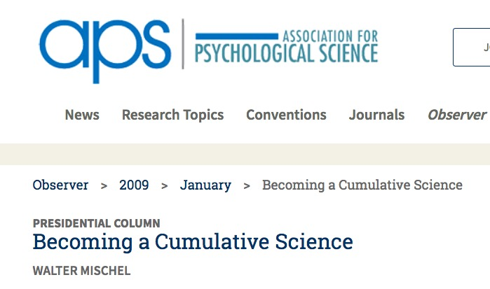

```{r setup, include=FALSE}
knitr::opts_chunk$set(echo = FALSE)

if(!("revealjs" %in% installed.packages()[,1])) {
  install.packages("revealjs") }
require("revealjs")
```

---

**Rick Gilmore** (Penn State/Databrary), "The Promise of Open Developmental Science"

**Anne Mastergeorge** (Texas Tech University), "An analysis of the association between brain gray matter volumes and working memory in children with autism spectrum disorder"

**Melissa Kline** (MIT), "ManyBabies - Using Larg(er) Experimental Datasets for Methodological and Theoretical Questions"

---


</br>


</br>


# Developmental science is harder than physics

---


---


# But...

---

<video width="1000" data-autoplay>
  <source src="../mov/neurosynth-happy.mp4" type="video/mp4">
Your browser does not support the video tag.
</video>
</br>
<http://neurosynth.org>

---

<video width="900" data-autoplay>
  <source src="../mov/wordbank-vocabulary.mp4" type="video/mp4">
Your browser does not support the video tag.
</video>
</br>
<http://wordbank.stanford.edu>

---

<video height="600" controls data-autoplay>
  <source src="../mov/Construction.mp4" type="video/mp4">
Your browser does not support the video tag.
</video>

*Source*: Ori Ossmy (NYU)

---

<video width="900" data-autoplay>
  <source src="../mov/summarize_demog.mp4" type="video/mp4">
</video>
</br>
<http://github.com/PLAY-behaviorome/databraryapi>

---


</br>
<audio controls data-autoplay>
  <source src="https://nyu.databrary.org/slot/12213/0,15046/asset/46757/download?inline=true" type="audio/mpeg">
Your browser does not support the audio element.
</audio>
<audio controls>
  <source src="https://nyu.databrary.org/slot/12212/0,15046/asset/46748/download?inline=true" type="audio/mpeg">
Your browser does not support the audio element.
</audio>
</br>
</br>
Cole, P.M., Gilmore, R.O., Scherf, K.S. & Perez-Edgar, K. (2016). The Proximal Emotional Environment Project (PEEP). Databrary. http://doi.org/10.17910/B7.248

---

<video width="700" data-autoplay>
  <source src="https://nyu.databrary.org/slot/9809/1,17000/asset/11354/download?inline=true" type="video/mp4">
Your browser does not support the video tag.
</video>

Naigles, L. (2014). Children use syntax to learn verb meanings. Databrary. Retrieved October 4, 2018 from http://doi.org/10.17910/B7J01M.

---

<video width="900" controls data-autoplay>
  <source src="https://nyu.databrary.org/slot/14765/0,21000/asset/64898/download?inline=true" type="video/mp4">
Your browser does not support the video tag.
</video>

The PLAY Project Wiki: <https://dev1.ed-projects.nyu.edu/wikis/docuwiki/doku.php/landing>

---


---

## Studies are ~~not~~ underpowered


</br>


---

<a href="https://www.psychologicalscience.org/observer/becoming-a-cumulative-science">

</a>

---

- Findings accumulate
- Theories are advanced, accepted, expanded, or *rejected*

---


# Remaining barriers

---


<!-- Who owns your data? -->

---

<video width="800" data-autoplay>
  <source src="../mov/how-unique.mp4" type="video/mp4">
Your browser does not support the video tag.
</video>
</br>

[Latonya Sweeney's Data Privacy Lab](https://aboutmyinfo.org/demogs/compute.php)

<!-- Reidentifiability often not hard -->

---

<video width="800" data-autoplay>
  <source src="../mov/stroop-data.mp4" type="video/mp4">
Your browser does not support the video tag.
</video>
</br>

<!-- Hard to find data you'd want to re-use -->

---


<!-- Restoring behavior to psychology alongside internal mental (and neural) states -->

---


<http://www.cognitiveatlas.org/>

---


<https://github.com/mekline/psych-DS>

---


---

> "*...psychologists tend to treat other peoples’ theories like toothbrushes; no self-respecting individual wants to use anyone else’s.*"

[(Mischel, 2009)](https://www.psychologicalscience.org/observer/becoming-a-cumulative-science)

---

> "*The toothbrush culture undermines the building of a genuinely cumulative science, encouraging more parallel play and solo game playing, rather than building on each other’s directly relevant best work.*"

[(Mischel, 2009)](https://www.psychologicalscience.org/observer/becoming-a-cumulative-science)

# Share not your toothbrush...

## But do share...

- Data
    - & analysis code/scripts (R, Python, SPSS, SAS, ...)
    - Rawest possible (trial-level, individual, ...)
- Displays (& code to generate)
- Protocols & procedures
    - Video as a gold standard
    
---

<div class="centered">
<a href="http://www.apa.org/science/about/psa/2017/10/video-data.aspx">

</div>

---

<video width="800" controls data-autoplay>
  <source src="https://nyu.databrary.org/slot/9838/-/asset/9963/download?inline=true" type="video/mp4">
Your browser does not support the video tag.
</video>
</br>
Adolph, K. (2014). Excerpt Volume: Learning in the development of infant locomotion. Databrary. Retrieved October 5, 2018 from http://doi.org/10.17910/B7BC7T

<!-- Rich behavioral measures tell a rich story -->

---

<video width="800" controls data-autoplay>
  <source src="https://nyu.databrary.org/slot/21794/0,407508/asset/108263/download?inline=true" type="video/mp4">
Your browser does not support the video tag.
</video>

Soderstrom, M. & Klassen, K. (2017). ManyBabies 1: bll-umanitoba. Databrary. Retrieved October 4, 2018 from http://doi.org/10.17910/B7.445

## Where

- Data repository
    - [ICPSR](https://www.icpsr.umich.edu/), [Dataverse](http://dataverse.org), [OSF](https://osf.io), [Dryad](https://) (domain/measure general)
    - [Databrary](https://databrary.org) (behavioral science; video/audio ++)
    - [OpenNeuro](https://openneuro.org), [TalkBank](https://talkbank.org), [WordBank](http://wordbank.stanford.edu/) (measure-specific)
- Supplemental material with article
- Data paper (e.g. *Nature Scientific Data*)
- Institutional repository

---


## With whom

- Public
- Researchers
- People you select & vet

## With whom

- *Public*
    - *Risks of reidentification?*
    - *Can you really anonymize?*
- **Researchers**
    - ICPSR, Databrary, & OpenNeuro
- ~~People you select & vet~~

## When 

- Soon after you collect it
- On manuscript submission
- On acceptance or publication
- End of grant
- ~~When I'm damn good and ready...~~

## How


Wilkinson, M. D., Dumontier, M., Aalbersberg, I. J. J., Appleton, G., Axton, M., Baak, A., Blomberg, N., et al. (2016). The FAIR Guiding Principles for scientific data management and stewardship. Scientific data, 3, 160018. Retrieved from http://dx.doi.org/10.1038/sdata.2016.18

---

<video data-autoplay>
  <source src="../mov/databrary-spreadsheet.mp4" type="video/mp4">
Your browser does not support the video tag.
</video>

---

<video data-autoplay>
  <source src="../mov/databrary-search-hires.mp4" type="video/mp4">
Your browser does not support the video tag.
</video>

## Share ethically

- Ask permission to share (especially for sensitive, identifiable data)
    - [(Gilmore & Nilsonne, 2017)](https://osf.io/9d5hr/)
    - Use template language: [Databrary's](https://www.databrary.org/resources/templates/release-template.html)

---


<https://www.databrary.org/resources/guide/investigators/release/release-levels.html>

---

<video data-autoplay>
  <source src="https://www.databrary.org/video/example-video-1.mp4" type="video/mp4">
Your browser does not support the video tag.
</video>

<https://www.databrary.org/resources/guide/investigators/release/asking/examples.html>

---

- Don't promise to destroy data (but GDPR?)
- Don't unduly restrict future reuses

---

>"*the principles of human subject research require an analysis of both risks and benefits...such an analysis suggests that researchers may have a positive duty to share data in order to maximize the contribution that individual participants have made.*"

<small>([Brakewood & Poldack, 2013](http://dx.doi.org/10.1016/j.neuroimage.2013.02.040))</small>

## Share openly

- Without restriction on others' reuse
- Without *quid pro quo*, pre-approval, or requirement of co-authorship
- *With* expectation of ethical use **AND** proper citation

## Play & Learning Across a Year (PLAY) Project

<div class="centered">
<video width="700"data-autoplay>
  <source src="https://nyu.databrary.org/slot/27087/0,79000/asset/119877/download?inline=true" type="video/mp4">
Your browser does not support the video tag.
</video>

$n=900$ 12-, 18-, 24-mo-olds; $n=30$ sites

**Hiring Research Scientists (PhD/ABD):** <http://apply.interfolio.com/54828>

---


<!-- We don't have to have physics envy -->

---

<div class="centered">

</div>

---

> "The advancement of detailed and diverse knowledge about the development of the world’s children is essential for improving the health and well-being of humanity. We regard scientific integrity, transparency, and openness as essential for the conduct of research and its application to practice and policy."

SRCD Task Force on Scientific Integrity and Openness

---

<div class="centered">

</div>

---


---

<video width="800" loop data-autoplay>
  <source src="../mov/databrary-splash.mp4" type="video/mp4">
</video>

rogilmore@psu.edu

<https://gilmore-lab.github.io>

<https://gilmore-lab.github.io/DEVSEC-2018/promise-of-open-dev-sci/>

---

This talk was produced on `r Sys.time()` in [RStudio 1.1.453](http://rstudio.com) using R Markdown and the reveal.JS framework.
The code and materials used to generate the slides may be found at <https://github.com/gilmore-lab/DEVSEC-2018/promise-of-open-dev-sci/>. 
Information about the R Session that produced the slides is as follows:

---

```{r session-info}
sessionInfo()
```
