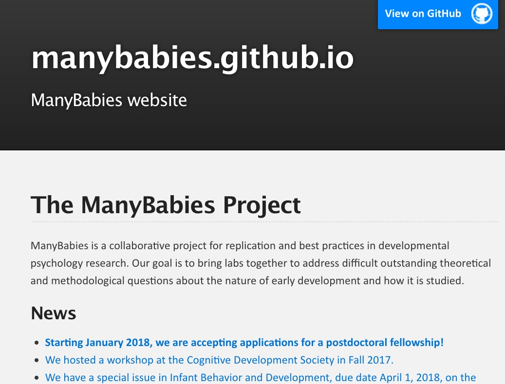

```{r setup, include=FALSE}
knitr::opts_chunk$set(echo = FALSE)

if(!("revealjs" %in% installed.packages()[,1])) {
  install.packages("revealjs") }
require("revealjs")
```

---


</br>


</br>


## Overview

- Imagine...
- Barriers
- Progress
- Yes, we can

# Imagine...

## ...meta-analyses from your desktop

---

<video width="900" controls data-autoplay>
  <source src="../mov/neurosynth-happy.mp4" type="video/mp4">
Your browser does not support the video tag.
</video>
</br>
<http://neurosynth.org>

## ...visualization of task data accumulated across studies & labs

---

<video width="900" controls data-autoplay>
  <source src="../mov/wordbank-vocabulary.mp4" type="video/mp4">
Your browser does not support the video tag.
</video>
</br>
<http://wordbank.stanford.edu>

## ...machine-learning-assisted analysis

---

<video height="600" controls data-autoplay>
  <source src="../mov/Construction.mp4" type="video/mp4">
Your browser does not support the video tag.
</video>

*Source*: Ori Ossmy (NYU)

## ..."scriptable" analyses and visualizations from centrally stored & shared data

---

<video width="900" controls data-autoplay>
  <source src="../mov/summarize_demog.mp4" type="video/mp4">
</video>
</br>
<http://github.com/PLAY-behaviorome/databraryapi>

## ...easy...

## downloading and reuse of others' materials

---


</br>
<audio controls data-autoplay>
  <source src="https://nyu.databrary.org/slot/12213/0,15046/asset/46757/download?inline=true" type="audio/mpeg">
Your browser does not support the audio element.
</audio>
<audio controls>
  <source src="https://nyu.databrary.org/slot/12212/0,15046/asset/46748/download?inline=true" type="audio/mpeg">
Your browser does not support the audio element.
</audio>
</br>
</br>
Cole, P.M., Gilmore, R.O., Scherf, K.S. & Perez-Edgar, K. (2016). The Proximal Emotional Environment Project (PEEP). Databrary. http://doi.org/10.17910/B7.248.

## ...reproduction of others' procedures through video protocols

---

<video width="800" controls data-autoplay>
  <source src="https://nyu.databrary.org/slot/14765/0,79273/asset/64898/download?inline=true" type="video/mp4">
Your browser does not support the video tag.
</video>

The PLAY Project Wiki: <https://dev1.ed-projects.nyu.edu/wikis/docuwiki/doku.php/landing>

## ...A truly cumulative developmental science

<a href="https://www.psychologicalscience.org/observer/becoming-a-cumulative-science">

</a>

## Where

- Findings accumulate
- Theories are advanced, accepted, expanded, or rejected
- Phenomena become increasingly predictable
- Discovery accelerates

# Barriers

## Psychological science is harder than physics

---


---


## Studies are underpowered

---

<div class="centered">


<small>([Szucs & Ioannides, 2017](http://doi.org/10.1371/journal.pbio.2000797))</small>
</div>

<div class="notes">
As Szucs and Ioannides have shown based on an analysis of more than 10,000 papers in the cognitive neuroscience literature, sample sizes are small, and the probability of false negatives is high, especially for small to medium effect sizes.
</div>

---

<div class="centered">
> "Assuming a realistic range of prior probabilities for null hypotheses, false report probability is likely to exceed 50% for the whole literature."

<small>([Szucs & Ioannides, 2017](http://doi.org/10.1371/journal.pbio.2000797))</small>
</div>

## Published papers have errors

---

<div class="centered">
<a href="http://doi.org/10.3758/s13428-015-0664-2)">

</a>
</div>

---

<div class="centered">

</div>

<small>([Nuijten et al., 2015](http://doi.org/10.3758/s13428-015-0664-2))</small>

<div class="notes">
Statistical reporting errors in the published literature are more common that many might think.
</div>

## Confusion about data ownership

- Institutions
- Taxpayers
- Researchers
- Participants

## Eagerly share findings but not data or materials

---

<div class="centered">


<small>([Wicherts et al., 2006](http://doi.org/10.1037/0003-066X.61.7.726))</small>
</div>

## Blinded from seeing the whole elephant

---


## Fall victim to the toothbrush problem (Mischel, 2009)

---

> "*...psychologists tend to treat other peoples’ theories like toothbrushes; no self-respecting individual wants to use anyone else’s.*"

---

> "*The toothbrush culture undermines the building of a genuinely cumulative science, encouraging more parallel play and solo game playing, rather than building on each other’s directly relevant best work.*"

# Solutions

## Mischel 2009

- Common tools
- Robust, replicable, consequential findings
- Boundary crossing and bridge building
    
## Make open data & materials sharing 

## ...the norm not the exception

## Plan for sharing

- From the earliest stages
- Data Management Plans (NSF and NIH proposals)
- Data as a "first order" research product

## What to share

- Data
    - & analysis code/scripts (R, Python, SPSS, SAS, ...)
    - Rawest possible (trial-level, individual, ...)
- Displays (& code to generate)
- Protocols & procedures
    - Video as gold standard

---

<div class="centered">
<a href="http://www.apa.org/science/about/psa/2017/10/video-data.aspx">

</div>

---

<a href="https://dev1.ed-projects.nyu.edu/wikis/docuwiki">

</a>

The PLAY Project Wiki: <https://dev1.ed-projects.nyu.edu/wikis/docuwiki/doku.php/landing>

## Where to share

- Data repository
    - [ICPSR](https://www.icpsr.umich.edu/), [Dataverse](http://dataverse.org), [OSF](https://osf.io), [Dryad](https://) (domain/measure general)
    - [Databrary](https://databrary.org) (behavioral science; video/audio ++)
    - [OpenNeuro](https://openneuro.org), [TalkBank](https://talkbank.org), [WordBank](http://wordbank.stanford.edu/) (measure-specific)
- Supplemental material with article
- Data paper (e.g. *Nature Scientific Data*)
- Institutional repository

## With whom

- Public
    - Risk of reidentification
    - Can you really anonymize?
- Researchers
    - ICPSR, Databrary, & OpenNeuro
- People you select & vet

## When 

- Soon after you collect it
- On manuscript submission
- On acceptance or publication
- End of grant
- ~~When I'm damn good and ready...~~

## How

- "FAIRly"
- **F**indable, **A**ccesible, **I**nteroperable, and **R**eusable [(Wilkinson et al., 2016)](http://dx.doi.org/10.1038/sdata.2016.18)
    - Easier to find in repository
    - Interoperable formats
    - Codebooks

## Ethically

- Ask permission to share (especially for sensitive, identifiable data)
    - Use template language
    - [(Gilmore & Nilsonne, 2017)](https://osf.io/9d5hr/)
- Don't promise to destroy data (but GDPR?)
- Don't unduly restrict future reuses

---

>"*the principles of human subject research require an analysis of both risks and benefits...such an analysis suggests that researchers may have a positive duty to share data in order to maximize the contribution that individual participants have made.*"

<small>([Brakewood & Poldack, 2013](http://dx.doi.org/10.1016/j.neuroimage.2013.02.040))</small>

## Openly

- Without restriction on others' reuse
- Without *quid pro quo*, pre-approval, or requirement of co-authorship
- *With* expectation of ethical use **AND** proper citation

---



# Let's

## ...build platforms for discovery

that will make physicists jealous

## ...acknowledge the elephant in the room

---

<div class="centered">

</div>

<div class="notes">
To make the future of big data behavioral science one where we're not just blind men studying our small part of the elephant.
</div>

---

<div class="centered">

</div>

## ...build a

>- Robust
>- Transparent
>- Reproducible
>- Powerful
>- Openly shared
>- Cumulative
>- (Awesome!)
>- Psychological Science

---


## Open! (Says me)

<video width="600" loop data-autoplay>
  <source src="../mov/databrary-splash.mp4" type="video/mp4">
</video>

rogilmore@psu.edu

<https://gilmore-lab.github.io>

<https://github.com/gilmore-lab/2018-05-26-aps-opensaysme/>

---

This talk was produced on `r Sys.time()` in [RStudio 1.1.383](http://rstudio.com) using R Markdown and the reveal.JS framework.
The code and materials used to generate the slides may be found at <https://github.com/gilmore-lab/2018-05-26-aps-opensaysme/>. 
Information about the R Session that produced the slides is as follows:

---

```{r session-info}
sessionInfo()
```
